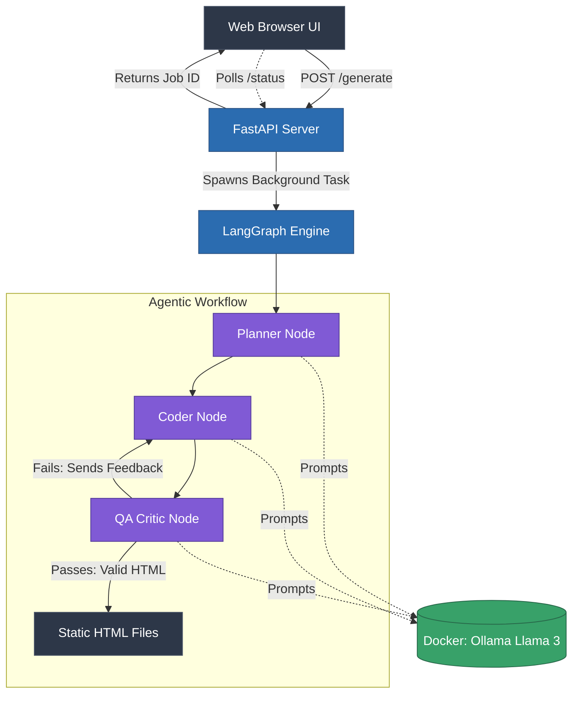

# 🤖 Autonomous AI Web Builder

A local, multi-agent AI system built with LangGraph, FastAPI, and Docker that autonomously plans, codes, and refines fully responsive websites from simple text prompts. 

This system uses an asynchronous job queue and a local instance of Llama 3 to ensure a robust, non-blocking user experience without relying on external API credits.

## 🏗️ System Architecture

The core of this engine is a **State Machine** managed by LangGraph. It features three distinct AI agents that critique and correct each other before delivering the final code.


## Key Features

    Agentic QA Loop: A strict "Critic" node parses the generated HTML using BeautifulSoup, checks for lazy placeholders, and forces the Coder to rewrite until the layout matches the spec (up to 8 iterations).

    Async Job Polling: The FastAPI backend queues generations in the background. The UI polls for updates, preventing browser timeouts during long LLM inference times.

    100% Local & Private: Powered entirely by Ollama running Llama 3. No OpenAI keys required.

    Fully Dockerized: Abstracted environment handling. No virtual environments or manual dependencies required to run the stack.
## How to Run
Prerequisites

   ``` Docker and Docker Compose installed.```

Start the Stack

    ``` Clone the repository and navigate to the directory.

    Spin up the containers:```

   sudo docker compose up -d --build 

    ```(First run only) Pull the Llama 3 weights into the local container:
    Bash```

    sudo docker compose exec ollama ollama pull llama3

    ```Open your browser and navigate to http://localhost:8001.```
🧪 Demo / Example

The Input Prompt:

    "Build a premium, dark-mode landing page for an open-source biomedical signal processing framework called 'NeuroSync'. The Hero section must take up the exact full viewport height, featuring a massive gradient headline, a technical sub-headline, and two CTA buttons ('View Documentation' and 'GitHub'). Below the fold, create a 'Core Capabilities' section using a responsive 3-column grid. Each grid card must contain detailed, realistic technical paragraphs explaining features like 'RRAM Characterization', 'Real-time Processing', and 'Hardware Integration'. Finish with a styled contact form using dark input fields. Do NOT use any 'Lorem Ipsum' or HTML comments."
---

/
├── docker-compose.yml   # Orchestrates FastAPI and Ollama
├── Dockerfile           # Python 3.10 environment build
├── requirements.txt     # Python dependencies
├── server.py            # FastAPI async queue and frontend UI
├── engine.py            # LangGraph multi-agent state machine
└── output_site/         # Auto-generated static files (git-ignored)
You will automatically be directed to localhost:8001 after the process is complete.
